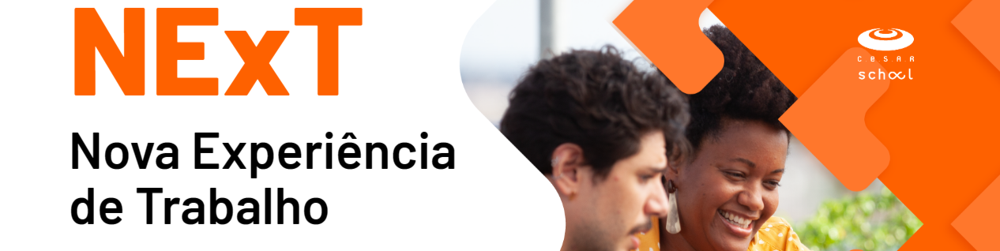

Seja bem-vindo à Comunidade NExT 2023.1! 🚀

Somos um programa acelerado de desenvolvimento de software que capacita profissionais nas linguagens mais atualizadas e os conecta ao ecossistema de TI. Além das habilidades técnicas, valorizamos as soft skills, como pensamento crítico e habilidades socioemocionais.

Compartilhamos aqui códigos, materiais de aula em repositórios, exercícios e outros recursos. O objetivo é fornecer um ambiente de aprendizado colaborativo e aberto, onde todos podem acessar os materiais necessários para alcançar suas metas na área de TI.

Nosso hub de código aberto é uma estação de inspiração e aprendizado. Independentemente do tamanho do seu desafio, todos os recursos estarão disponíveis para apoiar o seu crescimento profissional.

Junte-se à Comunidade NExT 2023.1 e embarque em uma jornada educacional enriquecedora. Estamos ansiosos para moldar juntos o futuro da tecnologia! 💻🌟

Visite [NExT Nova Experiência de Trabalho](https://www.cesar.school/next-nova-experiencia-de-trabalho/) para saber mais!
